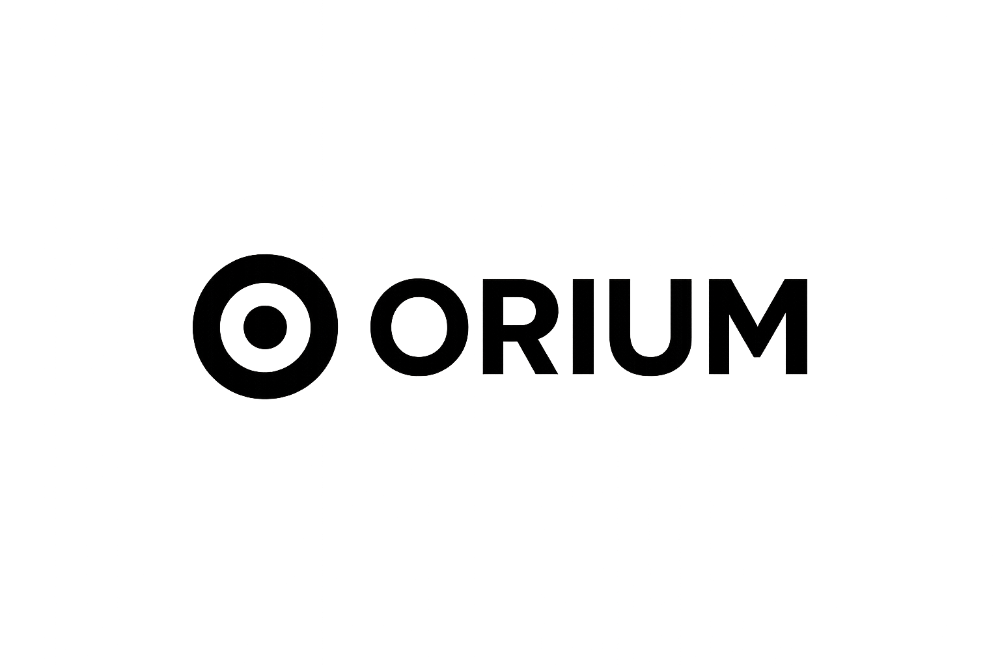
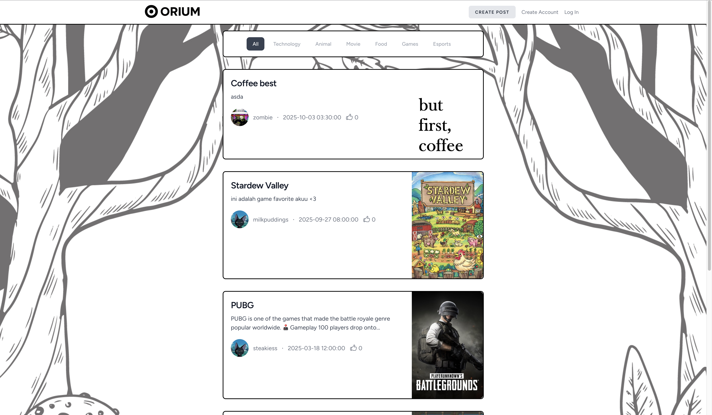
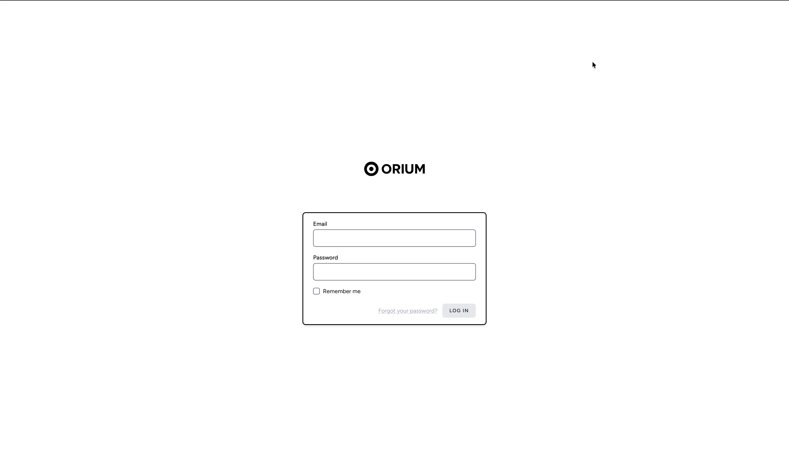
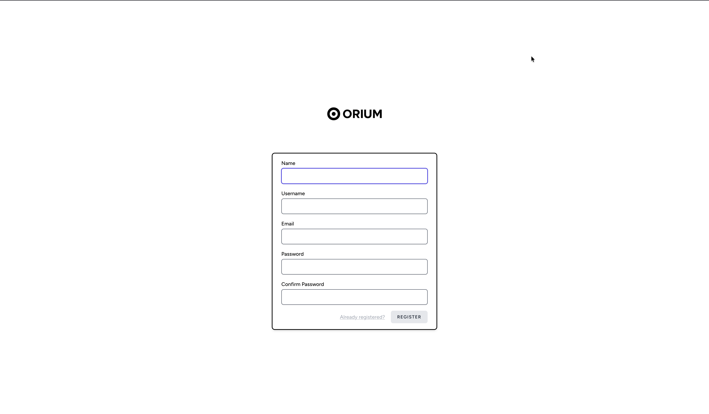
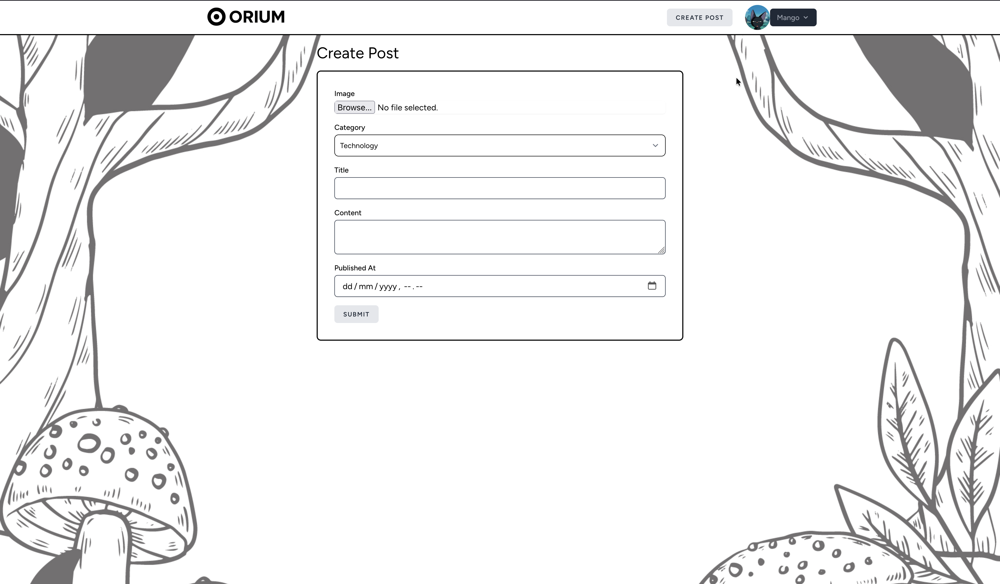
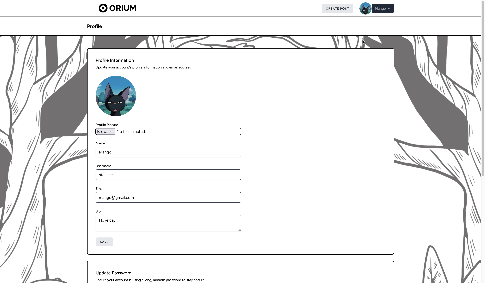
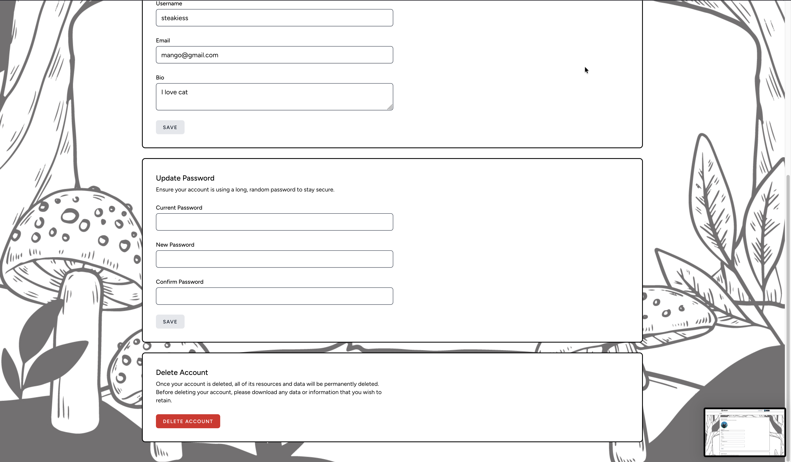
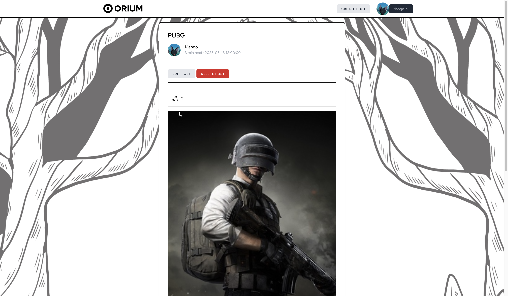

<p align="center">
    
</p>
<p align="center">
    <b>A modern social posting platform – Share, Explore, and Connect.</b><br>
    Built with ❤️ using <a href="https://laravel.com" target="_blank">Laravel</a>.
</p>
<p align="center">
    
    
    
    
</p>

---

## 🌟 Features

- 📝 Create and share posts with text & images
- ❤️ Like & comment on posts
- 👤 Profile pages with followers system
- 📱 Responsive design (mobile-first)

---

## 📸 Screenshots

<p align="center">
    
    <br><em>Public Page</em>
</p>

<p align="center">
    
    <br><em>Login Page</em>
</p>

<p align="center">
    
    <br><em>Register Page</em>
</p>

<p align="center">
    
    <br><em>Create Post Page</em>
</p>

<p align="center">
    
    <br><em>Profile Page- View posts and followers</em>
</p>

<p align="center">
    
    <br><em>Update & Delete Page</em>
</p>

<p align="center">
    
    <br><em>Post Detail Page</em>
</p>

<p align="center">
    
    <br><em>My Post Page</em>
</p>

---

## 🚀 Tech Stack

- **Backend:** [Laravel](https://laravel.com)
- **Frontend:** Blade + [TailwindCSS](https://tailwindcss.com)
- **Database:** MySQL
- **Authentication:** Laravel Breeze / Sanctum
- **Others:** AJAX / Livewire (optional for realtime features)

---

## 📦 Installation

1. **Clone the repo**
```bash
git clone https://github.com/your-username/orium.git
cd orium
```
